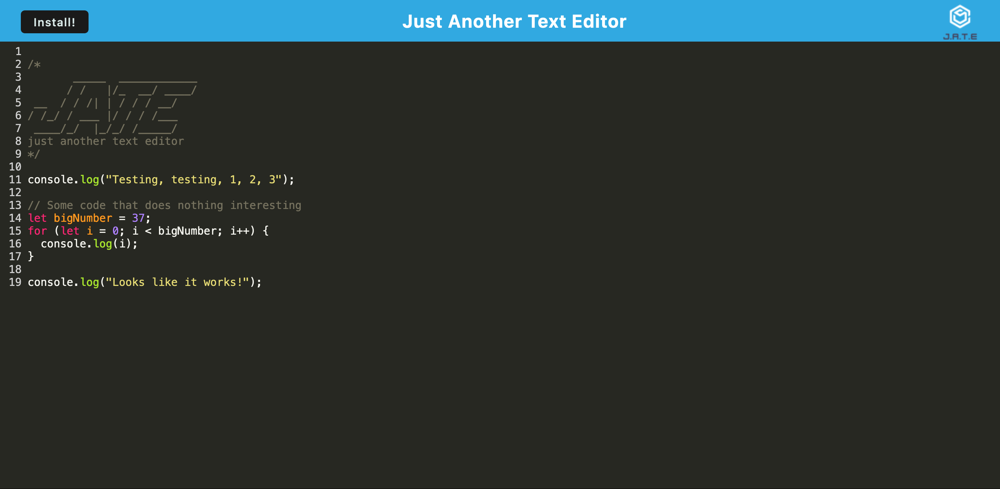

# Just Another Text Editor

## Description

This project is a text editor that allows you to edit text in your browser, complete with JavaScript syntax highlighting, and saves locally in the browser. It is a full-stack web app built with progressive web app principles, allowing it to run offline and to be installable.

Specifically it uses webpacks to bundle the code, service workers to handle caching, and localStorage and idb to redundantly save data locally. On the frontend, it uses Bootstrap for styling and CodeMirror for syntax highlighting, and on the backend it uses Node as the platform and Express for the server.

In completing this project, I came to realize the power of PWA techniques and to realize that sometimes, for some of them, it's less like writing a new piece of code and more like getting someone else's code to do what you think it should. This was most obvious in using webpacks, where my main interaction with them was setting up the config file to work correctly.

## Installation

To use this project, no installation is needed. Simply visit https://text-editor-kppt.onrender.com/ to use the deployed app in your web browser.

To run a local instance, clone the code from GitHub, navigate to the project's root directory, and run `npm run install` to install and then `npm run start` to build and start the server. Once running, you can visit the app locally at http://localhost:[PORT], where [PORT] is the port number the app prints to the command line.

## Usage

To use this app, simply click in the text area and start typing! Clicking out of the text area will automatically save your progress to your browser, so it will be there if you exit the browser and come back later. To install the app on your computer, simply click on the "Install!" button.

Here is a screenshot of the functioning app: 

## Credits

This project consists largely of code provided by edX Boot Camps LLC. The portions of code that I wrote include the `putDb()` and `getDb` functions in `/client/src/js/database.js`, the event listeners in `/client/src/js/install.js`, the asset caching and offline fallback functionality in `/client/src/src-sw.js`, the code adding plugins and loaders in `/client/webpack.config.js`, and the npm scripts in `package.json`.

## License

No license at this time.